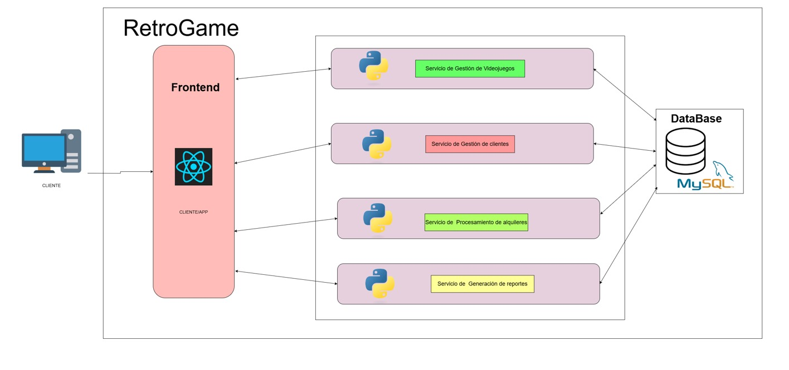

# Marco Alexander de León Hernández - 202010014
# Práctica 1
# RetroGames: Sistema enfocado en el Alquiler de Videojuegos Retro

### **Introducción**  

La  popularidad de los juegos tipo retro han ido aumentando la demanda de títulos clásicos, especialmente entre coleccionistas, jugadores con mucha nostalgia, con interesados en explorar la historia de algunos de los juegos mas populares. Se busca llenar un lugar en el mercado ofreciendo acceso fácil y organizado a juegos que de otra forma serían difíciles de encontrar. 

La solución va enfocada en el diseño y migración de un sistema de alquiler de juegos retro, todo esto pensado para un negocio especializado en brindar acceso a videojuegos clásicos para todos esos clientes que son muy apasionados y se dejan llevar por la nostalgia y la historia de los videojuegos. Este sistema va enfocado para  tienda física y sobre todo, digital, porque maneja un catálogo exclusivo de títulos retro, tomando en cuenta que estos ya no están disponibles en el mercado principal.  

### **Objetivos**  
Crear un sistema que permita al negocio ofrecer una experiencia eficiente y ordenada para sus clientes y administradores. 

- Gestionar el catálogo de videojuegos retro, asegurando que la información esté actualizada.  
- Facilitar el registro de clientes y el seguimiento de sus alquileres.  
- Generar reportes para analizar el desempeño del negocio y los hábitos de los clientes.  
- Asegurar que la transición de la arquitectura monolítica a la SOA mantenga todas las funcionalidades actuales del negocio mientras optimiza su estructura para el futuro.  

### **Arquitectura Monolítica**  

Esta arquitectura integra todas las funcionalidades en una única aplicación, todo  esto va a incior la interfaz de usuario para la interacción con los clientes, toda la lógica de negocio que gestiona las transacciones de alquiler, validación de usuarios, y generación de reportes, también hay una base de datos centralizada que almacena información sobre los juegos, clientes y registros de alquiler, el diseño permite una comunicación fluida entre los componentes.

### **Funcionalidades del Sistema Monolítico**  

1. **Gestión de videojuegos**:  
   - Registro de cada uno de los nuevos videojuegos en todo el catálogo.  
   - Consultar y actualizar toda la información sobre los videojuegos disponibles.  
2. **Gestión de clientes**:  
   - Registrar y dar un mantenimiento a la información de los clientes.  
   - El historial de alquileres asociado a cada uno de los clientes.  
3. **Procesamiento de alquileres**:  
   - Registro de alquileres, con un control de fechas de inicio y el vencimiento.  
   - La confirmación de devoluciones y actualización del estado de los videojuegos.  
4. **Generación de reportes**:  
   - Identificación de cada uno de los juegos más populares.  
   - El análisis de clientes más frecuentes y tendencias de uso.  

### **Diagrama de arquitectura orientada a servicios (SOA)**  

La arquitectura orientada a servicios (SOA) del sistema se pueden observar las funcionalidades en módulos independientes, cada uno representado por un servicio especializado, entonces todos estos servicios incluyen la gestión de  los juegos, clientes, procesamiento de alquileres y generación de reportes, los cuales interactúan mediante APIs para garantizar modularidad y bajo acoplamiento, lo que va a permitir esta arquitectura es escalabilidad, flexibilidad y mantenibilidad al facilitar actualizaciones o ampliaciones sin afectar todo el sistema.

### **Migración a SOA**  
La migración implica dividir el sistema en cuatro servicios independientes que mantendrán las funcionalidades actuales y permitirán mayor flexibilidad en el futuro. Los servicios serán los siguientes: 

1. **Servicio de Gestión de Videojuegos**: Este va a ser el responsable de registrar, consultar, y actualizar la información del catálogo de videojuegos.

2. **Servicio de Gestión de Clientes**: Este pues maneja el registro y mantenimiento de la información de los clientes, así como su historial de alquileres.  

3. **Servicio de Procesamiento de Alquileres**: Toda esta parte controla el flujo de alquileres y devoluciones, gestionando la disponibilidad de los videojuegos.  

4. **Servicio de Reportes y Análisis**: Esto genera estadísticas sobre el negocio, como los juegos más populares y los clientes más activos.  

### **Importancia**  

Los juegos tipo retro han estado siendo muy populares a lo largo de los años, gracias a la pasión de los fans por experiencias nostálgicas, todo esto va a crear una demanda específica que convierte al negocio de alquiler de juegos retro en una propuesta relevante en el mercado actual.

La escalabilidad va a ser un factor clave para este tipo de negocio, Conforme el catálogo de juegos o la base de clientes crezca, una arquitectura modular orientada a servicios va a permitir manejar eficientemente el aumento de la demanda, garantizando un funcionamiento fluido del sistema.

La flexibilidad de esta arquitectura también ofrece beneficios, como la separación de funcionalidades en servicios independientes facilita la incorporación de tecnologías, como sistemas de pago en línea o notificaciones automáticas, sin necesidad de tener que volver a hacer el sistema completo. 

### **Conclusión**  

La implementación del sistema va a proporcionar al negocio la capacidad de adaptarse rápidamente a los cambios en las demandas de los clientes, optimizando sus procesos actuales, ya que esto va a reducir costos de mantenimiento, ya que va a simplifica la gestión del sistema, va a aumentar la eficiencia, mejorando flujos de trabajo, permitiendo al negocio responder de manera ágil y eficiente a las necesidades del mercado. 
